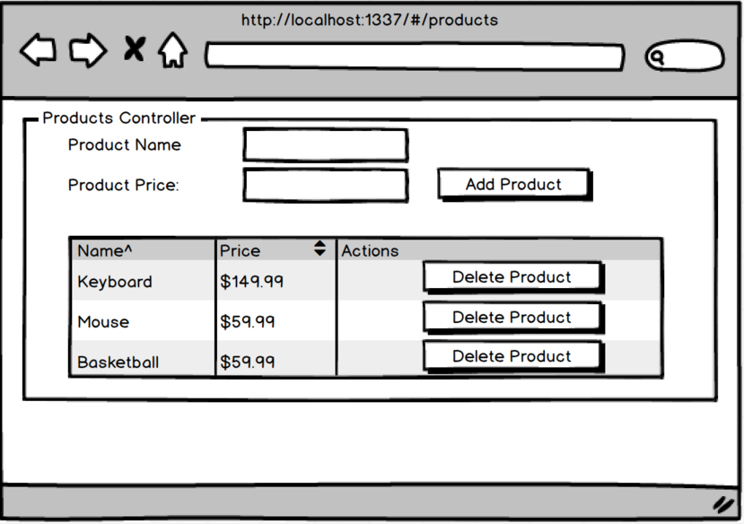

Products with a Factory

- Create a controller that has a factory injected into it.
- Have product price take a number, not a string.
- Store the product list in your factor.
- Create an add method in your factory that will add new products to your factory.
- Create a delete method in your factory that will remove products from your factory.
- Create an index method in your factory that will return your products.

tip: use: https://docs.angularjs.org/api/ng/filter/currency to properly style the price.

