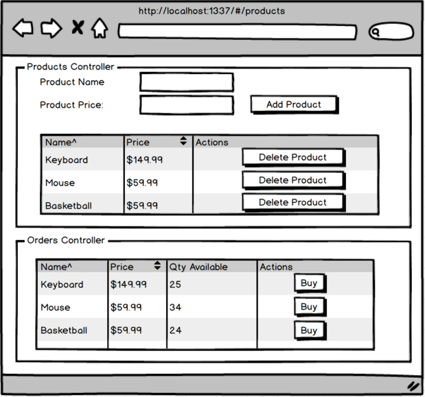

Implementing multiple controllers.

- New products are initialized with a qty of 50.
- Create 2 divs that are each controlled by their own controller.
- When a user clicks 'buy', decrement the quantity by 1.
- Prevent the quantity from dropping below 0.
